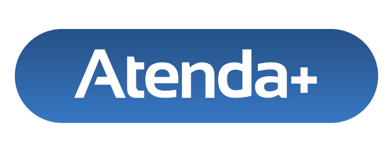
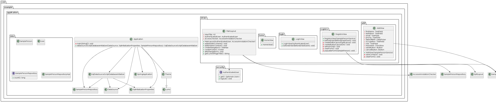

# Atenda+
Abrindo portas, sempre ao lado

## Descrição

Atenda+ é um projeto desenvolvido como parte da disciplina de Projetos 2 no curso de Gestão de Tecnologia da Informação na Cesar School. Este sistema permite que a coordenação de apoio psicopedagógico da instituição realize operações básicas de CRUD (Criar, Ler, Atualizar, Excluir) quanto ao atendimento do corpo estudantil, bem como a atualização da sua ficha de acompanhamento. 

## Fluxograma

  <a href="https://www.plantuml.com/plantuml/png/dLPFKzi-4BtxKtWu9GFay3jcViFm9r2OeP31j9TE3ukySJJ8ahjQ1sZBTwybX2Dm38PJx7rFJsztjNBsBGDnNQeagK3SGe7fbZ3b1E-Xh1HEeAgK5C3IwAtqJvAcGe6rwS4wxADfkfkM8FKeOvAw-F5pF4rNHkOUsavpOCXCJG8pGRBYMVD-0nRFj6G9Ilv66irQpawQ_L8jv3UPawcGMA9jGEziZcIDliBAMCc67iPJjshs_aQDfSUaJIIhdDyedHPPIwt9_RPQpcPtBJpKOw1VBx5SxtzUbyPPZwk_kxlNJQBBQPNyRnFvk-VbkimuyGxuLWcwxDvYT8b3opACsCrZsBe1AGuLwi_-yVrHcxY1YUSjbcg3twmlYTICj021FHjw6JU5mjIQHysWAACBFmPl7zgp9ZZ8hKLHa-G7xpZoSr3p4ZKx6kRERMkbG6_aidBhGVtlmBs0ALEOsiFX1daSP68bySx6DViAKf_3GwFLNb6ESorPuJGz_I_4uBN9QTVtCrK8jFPeYUBMq_phWTQ6lOK0X3JMsuywUZjzQyTXCUJvAKAET6Gqeuwh4U0PmLqVB0Y1yG9Mil3Y3ivaxY8l62V6C993dvu228lcELeTY_lM7TL4g7aE1VfgUdr_yN-iMvCcZnTVbJp_tiJRTYqaMRw0icdNDTxpYKIL1qX17u8bIDKDLqkZDx1pOBnS74hYvTJT63YNhWy1DKBKbJVSNKb6RT2JPMM8GVCqzIszCVS1iR32mvhPQJtz1a205gWsGDlF1Hd5yvaXhQJ0SIJhJW68-1HuNOL09uRAputIP6bAZBjpshn7xTbk0wFn1vMLAQIEfSzT8DPUHph3qyx83IuCuR5sH_Xm_NoyQjYVovYma9R9nDQkGYns5mNxcpFSec-M7yZZNBAXS6jaZJtspvkuuIm5xaokNd885uHs-OLaFk1O-04nLQs0qKDnJgzg6Lsh_H-vrwnE4pk4dhiq2IFWIHigdSIj64wAQfia-wXpzm_u7m00">
    
  </a>
  

[Ver o diagrama inteiro](https://www.plantuml.com/plantuml/png/dLPFKzi-4BtxKtWu9GFay3jcViFm9r2OeP31j9TE3ukySJJ8ahjQ1sZBTwybX2Dm38PJx7rFJsztjNBsBGDnNQeagK3SGe7fbZ3b1E-Xh1HEeAgK5C3IwAtqJvAcGe6rwS4wxADfkfkM8FKeOvAw-F5pF4rNHkOUsavpOCXCJG8pGRBYMVD-0nRFj6G9Ilv66irQpawQ_L8jv3UPawcGMA9jGEziZcIDliBAMCc67iPJjshs_aQDfSUaJIIhdDyedHPPIwt9_RPQpcPtBJpKOw1VBx5SxtzUbyPPZwk_kxlNJQBBQPNyRnFvk-VbkimuyGxuLWcwxDvYT8b3opACsCrZsBe1AGuLwi_-yVrHcxY1YUSjbcg3twmlYTICj021FHjw6JU5mjIQHysWAACBFmPl7zgp9ZZ8hKLHa-G7xpZoSr3p4ZKx6kRERMkbG6_aidBhGVtlmBs0ALEOsiFX1daSP68bySx6DViAKf_3GwFLNb6ESorPuJGz_I_4uBN9QTVtCrK8jFPeYUBMq_phWTQ6lOK0X3JMsuywUZjzQyTXCUJvAKAET6Gqeuwh4U0PmLqVB0Y1yG9Mil3Y3ivaxY8l62V6C993dvu228lcELeTY_lM7TL4g7aE1VfgUdr_yN-iMvCcZnTVbJp_tiJRTYqaMRw0icdNDTxpYKIL1qX17u8bIDKDLqkZDx1pOBnS74hYvTJT63YNhWy1DKBKbJVSNKb6RT2JPMM8GVCqzIszCVS1iR32mvhPQJtz1a205gWsGDlF1Hd5yvaXhQJ0SIJhJW68-1HuNOL09uRAputIP6bAZBjpshn7xTbk0wFn1vMLAQIEfSzT8DPUHph3qyx83IuCuR5sH_Xm_NoyQjYVovYma9R9nDQkGYns5mNxcpFSec-M7yZZNBAXS6jaZJtspvkuuIm5xaokNd885uHs-OLaFk1O-04nLQs0qKDnJgzg6Lsh_H-vrwnE4pk4dhiq2IFWIHigdSIj64wAQfia-wXpzm_u7m00)

## Executando a aplicação

O projeto é um projeto Maven padrão. Para executá-lo a partir da linha de comando,
digite `mvnw` (Windows) ou `./mvnw` (Mac & Linux), em seguida, abra
http://localhost:8080 em seu navegador.

Você também pode importar o projeto para sua IDE de escolha, assim como faria com qualquer
projeto Maven. Leia mais sobre [como importar projetos Vaadin para diferentes IDEs](https://vaadin.com/docs/latest/guide/step-by-step/importing) (Eclipse, IntelliJ IDEA, NetBeans e VS Code).

## Contribuições

Contribuições são bem-vindas! Se encontrar problemas ou tiver sugestões de melhoria, por favor, abra um problema neste repositório.

## Desenvolvedores

- mxs2@cesar.school
- vrln2@cesar.school
- jll@cesar.school
- cjam@cesar.school

## Licença

Este projeto está licenciado sob a Licença MIT - consulte o arquivo [LICENSE](LICENSE) para mais detalhes.